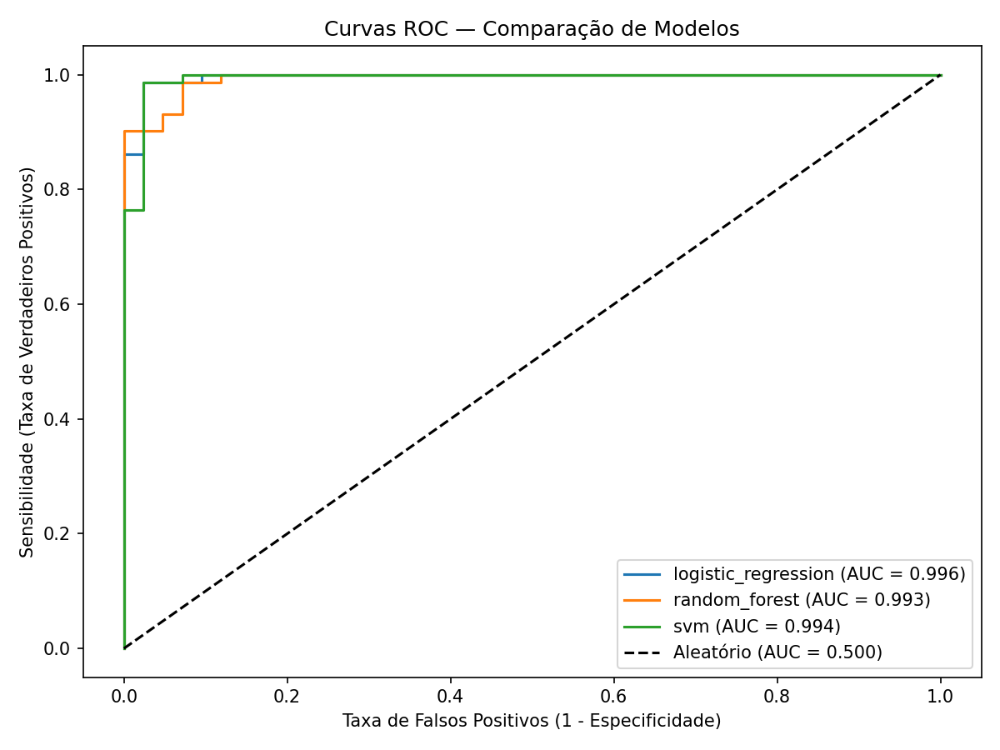
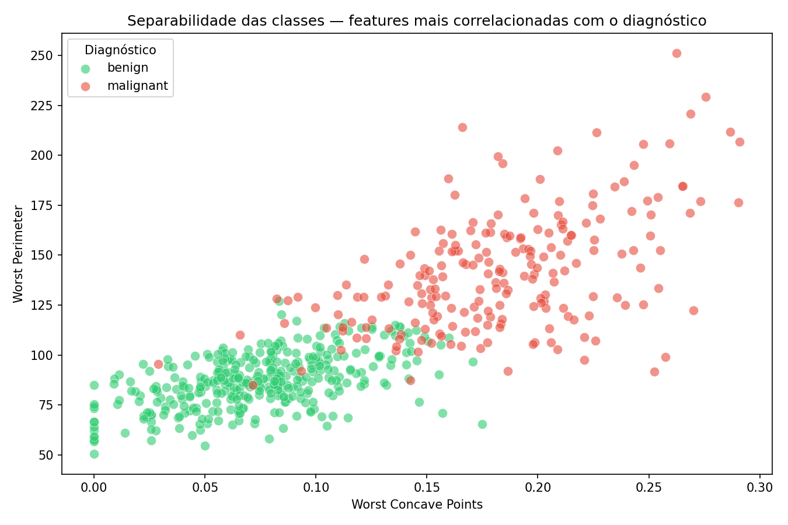
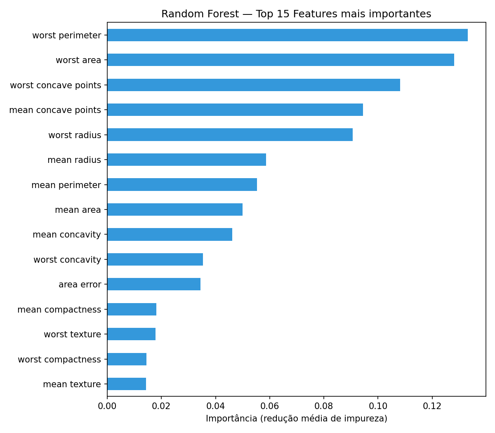
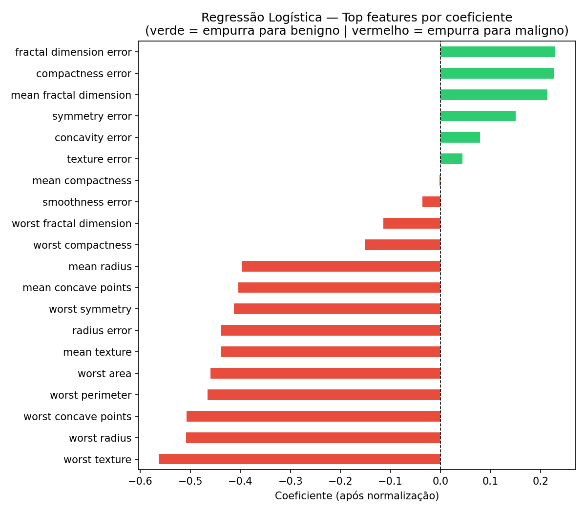
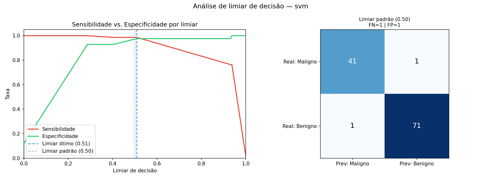

# OncoPredict-ML

An end-to-end Machine Learning pipeline for breast tumor classification using clinical tabular data.

> **Educational and portfolio project.** Not intended for clinical use and does not replace professional medical diagnosis.

Developed by **Felipe Borges** — Medical Physics Student @ UFCSPA, at the intersection of AI, Data Science, and Healthcare Technology.

---

## Overview

OncoPredict-ML demonstrates a complete supervised ML pipeline applied to a clinical classification problem, covering every fundamental stage of a real-world ML system:

- Exploratory data analysis with class separability and correlation studies
- Feature preprocessing and normalization
- Training and comparison of multiple classification algorithms
- Hyperparameter tuning via automated grid search
- Robust evaluation with accuracy, AUC, cross-validation, and confusion matrix
- Feature importance analysis (Random Forest + Logistic Regression coefficients)
- Decision threshold optimization using the Youden index
- Model serialization and inference on new data via CSV input

**Dataset:** [Breast Cancer Wisconsin](https://scikit-learn.org/stable/datasets/toy_dataset.html#breast-cancer-dataset) — 569 samples, 30 morphological features extracted from microscopic tumor images, binary classification (malignant / benign).

---

## Results

After automated hyperparameter tuning with `GridSearchCV` (5-fold cross-validation):

| Model | Accuracy | AUC | CV Mean | CV Std | Best Params |
|---|---|---|---|---|---|
| **SVM** | **98.2%** | **0.9937** | **97.8%** | 0.0139 | C=0.1, kernel=linear |
| Logistic Regression | 97.4% | 0.9957 | 98.0% | 0.0162 | C=0.1, solver=lbfgs |
| Random Forest | 95.6% | 0.9931 | 96.0% | 0.0192 | n_estimators=200 |

The best model was **SVM with a linear kernel** — grid search revealed that a linear decision boundary outperforms RBF, which is consistent with the high linear separability observed in the exploratory analysis.

The decision threshold analysis (Youden index) confirmed the model is well-calibrated: the optimal threshold (0.51) is virtually identical to the standard 0.50, meaning the predicted probabilities accurately reflect the true class distribution.

### ROC Curves


### Class Separability


### Feature Importance



### Threshold Analysis


---

## Project Structure

```
OncoPredict-ML/
├── notebooks/
│   ├── 01_exploratory_analysis.ipynb   # Data exploration and visualization
│   └── 02_model_training.ipynb         # Results analysis and interpretation
├── src/
│   ├── train.py                        # Full training and evaluation pipeline
│   └── predict.py                      # Inference on new samples (CLI + CSV)
├── models/
│   └── best_model.pkl                  # Serialized best model
├── reports/
│   ├── model_comparison.csv            # Metrics comparison across models
│   ├── threshold_analysis.txt          # Optimal threshold report
│   └── *_classification_report.txt     # Per-model classification reports
├── figures/                            # Generated plots and charts
├── test_env.py                         # Environment verification script
├── requirements.txt
└── README.md
```

---

## Getting Started

### 1. Clone the repository and set up the environment

```bash
git clone https://github.com/felipebborges2/OncoPredict.git
cd OncoPredict
python -m venv .venv
source .venv/bin/activate        # Linux/Mac
.venv\Scripts\activate           # Windows
pip install -r requirements.txt
```

### 2. Train the models

```bash
python src/train.py
```

This will:
- Run GridSearchCV to find the best hyperparameters for each model
- Evaluate all models on a held-out test set
- Generate ROC curves, feature importance plots and threshold analysis in `figures/`
- Save classification reports in `reports/`
- Serialize the best model to `models/best_model.pkl`

### 3. Run inference

```bash
# Using the built-in synthetic sample
python src/predict.py

# Using your own CSV file
python src/predict.py --input path/to/your/data.csv
```

The CSV file must contain one row per sample and one column per feature, using the same feature names as the training dataset.

### 4. Explore the notebooks

```bash
jupyter notebook
```

- `01_exploratory_analysis.ipynb` — dataset inspection, class separability, correlation heatmap, feature distributions
- `02_model_training.ipynb` — visual analysis of model results, ROC curves, feature importance

---

## Tech Stack

- Python 3.9+
- scikit-learn
- pandas / numpy
- matplotlib / seaborn
- joblib
- Jupyter Notebook

---

## Author

**Felipe Borges**
Medical Physics Student @ UFCSPA
Interests: AI in healthcare, radiomics, machine learning in oncology
